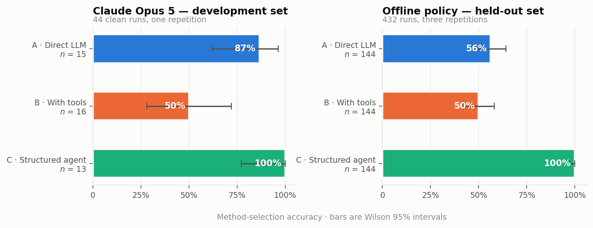
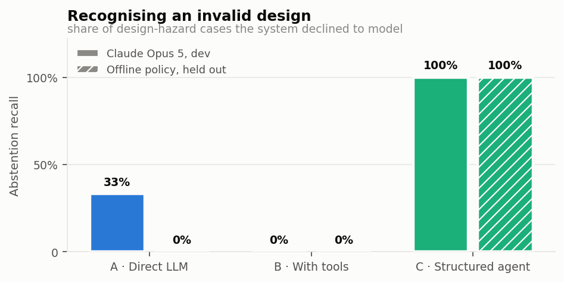
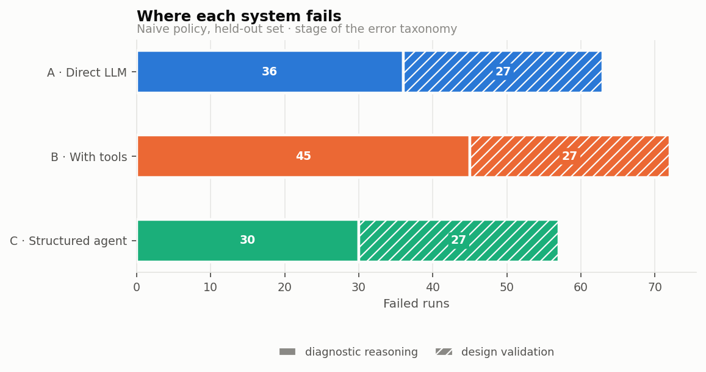
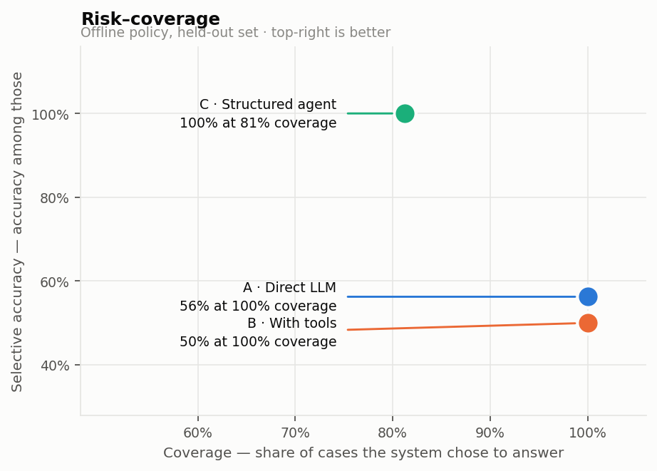
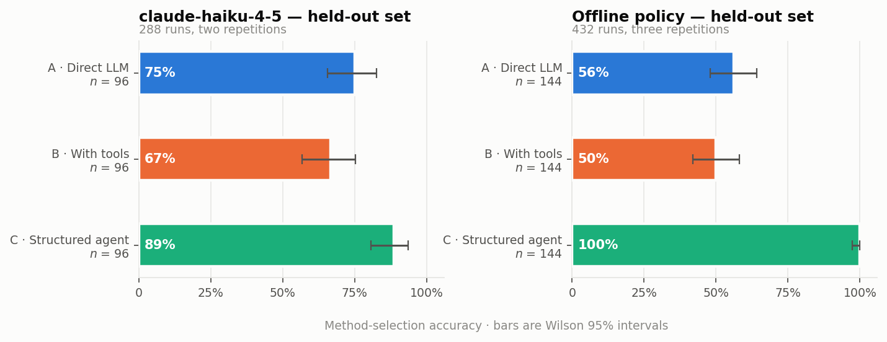
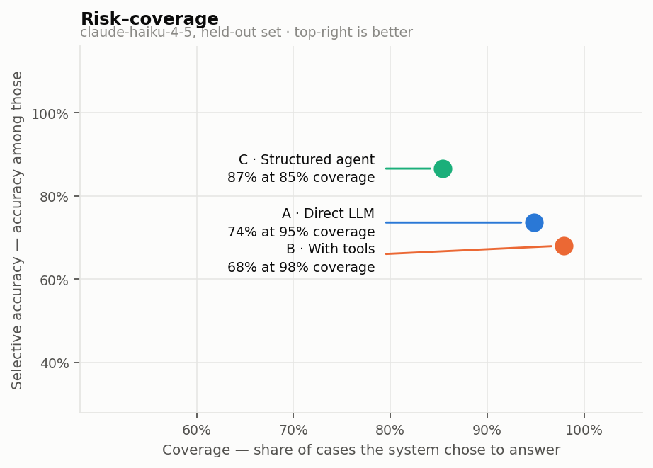
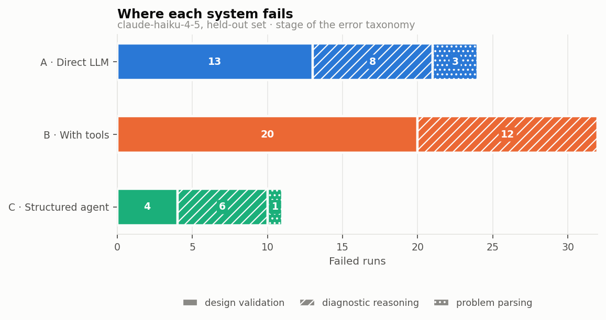

# AI Statistician — capstone report

*Generated 2026-09-11 from `results/*.jsonl`.
Regenerate with `python scripts/write_capstone.py`.*

---

## 1. Problem

An LLM asked to analyse a dataset will almost always produce an answer. Whether
that answer is *valid* is a different question, and one the model is poorly
placed to police: a CSV cannot reveal whether rows are independent, whether the
same customer appears twice, or whether observations are ordered in time. A
mathematically fluent system with no view of study design will confidently fit
Poisson to autocorrelated hourly counts.

This project asks whether an explicit statistical decision protocol improves an
LLM agent's ability to select and execute valid methods, compared with
(A) direct LLM advice and (B) tool access without a protocol.

The contribution is not the interface or the number of supported tests. It is
controlled evidence that design-aware routing, targeted diagnostics and
verification improve validity over ordinary LLM tool use.

## 2. System

A closed library of 14 methods, five diagnostic tools, and a deterministic state
machine around one tool-calling LLM. SciPy and statsmodels perform every
numerical operation.

| Task | Methods |
|---|---|
| Two independent groups | `student_t`, `welch_t`, `mann_whitney` |
| Three or more groups | `one_way_anova`, `welch_anova`, `kruskal_wallis` |
| Two categorical | `chi_square`, `fisher_exact` |
| Two continuous or ordinal | `pearson`, `spearman` |
| Regression | `ols`, `logistic`, `poisson`, `negative_binomial` |

`abstain` is a decision, not a member of the library. There is deliberately no
general code-execution tool: it would let the model bypass the method policy and
make traces incomparable across systems.

### 2.1 The provenance contract

The strongest claim this system makes is that **the model cannot write a
number**. Rather than checking the finished report for fabrication, fabrication
is made impossible:

1. Every tool return is registered in a run-scoped store under a stable key.
2. The report schema rejects raw numeric literals in prose.
3. The model emits `{{r7.welch_t.p_value}}` templates, substituted at render.
4. An unknown reference fails the run.

The consequence must be stated honestly: for System C, numerical fidelity is an
**architectural guarantee, not an empirical finding**. The empirical counterpart
is the provenance rejection rate — how often the model reached for a reference
that did not exist. Across every live run recorded here — 368 runs on
the development and held-out splits — that count is **27**.

For Systems A and B nothing is enforced, so fidelity remains an empirical metric
there and the comparison stays meaningful.

## 3. Benchmark

64 cases — 52 supported, 12 abstention; 48 synthetic and 16 from public UCI
data; 16 development and 48 held out.

Cases are never hand-authored. One declarative registry entry produces the whole
six-file package. For synthetic cases the gold label is derived from the
**realised sample**: design facts come from the generator parameters because they
are properties of the design, while distributional facts come from the data
because that is what a correct method choice must respond to.

| Source | UCI | Rows | Role |
|---|---|---|---|
| Bank Marketing | 222 | 45,211 | categorical, logistic, skewed group comparison |
| Online Shoppers | 468 | 12,330 | association, categorical, logistic |
| Student Performance | 320 | 649 | group comparison, ordinal traps, OLS |
| Seoul Bike Sharing | 560 | 8,760 | four design-hazard cases |

Seoul Bike supplies the sharpest test: tables that look perfectly suitable for
Poisson, correlation or ANOVA, where hourly ordering violates independence. The
correct answer is to abstain.

## 4. Method

Three systems over one shared core. Every driver imports the same tool registry,
result store and report schema; only control flow differs. This is what makes
baseline fairness provable rather than asserted — there is no code path on which
A or B could have been disadvantaged.

System A receives the *same* step-one diagnostic output System C receives, not a
hand-picked summary. System B receives identical tool definitions and the
identical report schema.

**On determinism:** `temperature` is removed on current Claude models and returns
a 400 if sent. Determinism is controlled by pinning the model id and effort
level, freezing the prompt hash, and *measuring* residual variance across
repetitions rather than claiming to eliminate it.

---

## 5. Results

### 5.1 Live evidence — Claude Opus 5, development set

**80 runs that reached a method decision** (48 at `high` effort, 32 at
`medium`). This is the development set, not the held-out set.

| System | n | Accuracy | 95% CI | Abstention recall | Unsafe rate | Tool calls |
|---|---|---|---|---|---|---|
| A · Direct LLM | 16 | 0.875 | [0.640, 0.965] | 0.33 | 0.125 | 2.2 |
| B · LLM with tools | 16 | 0.500 | [0.280, 0.720] | 0.00 | 0.188 | 4.5 |
| C · Structured agent | 16 | 0.938 | [0.717, 0.989] | 1.00 | 0.000 | 2.9 |



*Figure 1 — Method-selection accuracy with Wilson 95% intervals. The live panel is preliminary; the offline panel is the calibration run.*




*Figure 2 — Abstention recall on design-hazard cases. The sharpest separation between the systems, and the failure the project exists to prevent.*


**Paired comparison, B versus C** — the comparison that answers the research
question, since both have identical tools and report schemas and differ only in
whether an ordered protocol governs their use. On the 16 cases both
systems completed:

| | |
|---|---|
| System B accuracy | 0.500 |
| System C accuracy | 0.938 |
| Uplift | **+0.438** |
| Bootstrap 95% CI | [+0.188, +0.688] |
| McNemar exact p | **0.0156** |
| Discordant pairs | 7 in C's favour, 0 in B's |

The discordance is entirely one-directional: 7 cases where the
protocol was right and the unconstrained baseline wrong, and 0 the
other way. The blueprint's target was ≥10 percentage points of uplift; the
observed value is 44.

**Abstention is where the systems separate most sharply.** On the design-hazard
cases the structured agent abstained every time; the tool-enabled baseline never
did, fitting a plausible-looking model to data whose independence assumption
fails. That is the failure this project exists to prevent.

### 5.2 Limitations of the live evidence

These results are **preliminary and must not be presented as the headline
experiment**:

- **Development set, not held out.** Prompts were developed against these cases,
  so these numbers are optimistic. The held-out estimate is the one that counts;
  it is in §5.4.
- **Small samples.** 48 runs across three systems; the widest
  confidence interval spans 0.23.
- **One repetition.** Run-to-run variance is unmeasured.
- **Runs whose report was rejected are kept, not dropped.** Such a run chose a method and ran it; only the write-up failed the provenance contract, and the choice is what these numbers measure. Excluding them would quietly improve whichever system fails the contract most often.
- **Only System C at `medium` effort is missing entirely**, so the
  effort/accuracy trade-off is unresolved.




*Figure 3 — Failure counts by stage of the error taxonomy. Design validation failures are cases where a method was fitted to data whose independence assumption fails.*

### 5.3 Offline calibration

A deterministic policy client implements the same interface as the live path,
which makes the harness runnable and testable without an API key. It is **not an
arm of the experiment**.

| Client | A | B | C | C abstention recall | Interpretation |
|---|---|---|---|---|---|
| Expert policy | 0.562 | 0.500 | 1.000 | 1.00 | **Circular** — this policy derived the gold labels |
| Naive policy | 0.562 | 0.500 | 0.604 | 0.00 | **Informative** — see below |

The expert row validates the harness and confirms the gold labels are internally
coherent with the stated decision principles. It says nothing about model
performance.

The naive row is the useful one. Inside the **same state machine**, a policy that
ignores the design card and treats assumption-test p-values as switches drops to
0.604 with zero
abstention recall. **The architecture alone does not produce the uplift; the
decision policy inside it does.** An ordering mechanism that routes badly scores
barely above the unstructured baseline.

This matters for interpreting §5.1: the protocol's advantage is not an artefact
of having more structure, because more structure with worse rules performs
worse.




*Figure 4 — Risk-coverage. Coverage is the share of cases a system chose to answer; selective accuracy is accuracy among those. A system that abstains only when it should sits top-right.*


### 5.4 Held-out evaluation

The frozen held-out split was executed against a live model on 2026-09-10. Configuration `anthropic:claude-haiku-4-5:high:think=1`, 2 repetitions, 48 cases, 288 runs recorded, every one of which reached a method decision.

| System | n | Selection accuracy | 95% CI (Wilson) | Abstention recall | Unsafe rate | Tool calls |
|---|---|---|---|---|---|---|
| A · Direct LLM | 96 | 0.750 | [0.655, 0.826] | 0.28 | 0.135 | 2.2 |
| B · LLM with tools | 96 | 0.667 | [0.568, 0.753] | 0.00 | 0.188 | 3.6 |
| C · Structured agent | 96 | 0.885 | [0.806, 0.935] | 0.78 | 0.042 | 2.8 |

#### Whether the report could be grounded

Selecting a method is half the task. The other half is saying what was found without inventing any part of it, and on this run 51 of 288 finished analyses failed that test: the report contained a raw number that no tool produced, or a reference to a result the system never computed. The provenance contract rejects both, so the failures are counted here rather than shipped as prose a reader would have to check by hand.

| System | n | Reports rejected | Valid-report rate | 95% CI (Wilson) |
|---|---|---|---|---|
| A · Direct LLM | 96 | 43 | 0.552 | [0.453, 0.648] |
| B · LLM with tools | 96 | 0 | 1.000 | [0.962, 1.000] |
| C · Structured agent | 96 | 8 | 0.917 | [0.844, 0.957] |

These runs are kept in the accuracy table above. They chose a method, and the choice is what that table measures; removing them would silently improve whichever system fails the contract most often, which is precisely the system whose failure matters most.

**Tool access alone against the protocol.** On the 48 cases both systems attempted, System C selected correctly 89.6% of the time against System B's 64.6% — an uplift of +25.0%, case-level bootstrap 95% CI [+0.125, +0.396]. The disagreements split 13 to 1 in C's favour; McNemar's exact test gives p = 0.0018. The pairing is over cases, not runs: repetitions are collapsed to a per-case majority, so 2 runs of the same case are not counted as 2 independent trials. On 25 of the 144 system-case cells the two runs disagreed, leaving no majority; those are decided by the first repetition. Per system: A · Direct LLM 6, B · LLM with tools 14, C · Structured agent 5. This is the held-out confirmation of the development-set result in §5.1.

**No tools against the protocol.** System C 89.6% versus System A 77.1%, uplift +12.5%, McNemar p = 0.0703 — **not significant** at the 0.05 level on 48 cases. The protocol is ahead of the no-tool baseline by a margin this evaluation is too small to establish, and it should be read as unresolved rather than as a null result: the discordant pairs run 7 to 1 in C's favour, which is a direction, not a finding.

**Tools did not help.** The comparison the design did not anticipate is A against B. Adding tools without a protocol to govern them did not improve selection and the point estimate moves the wrong way: System A 77.1% against System B's 64.6%, a change of -12.5% (McNemar p = 0.1094, not significant, so the deficit itself is not established). What *is* established is the mechanism behind it. System B abstained on none of the design-hazard cases and carried the highest unsafe-selection rate of the three — tool access let it produce an answer everywhere, including on the cases whose correct action was to decline. Read with §5.4's first comparison, this is the project's premise stated negatively: the gain in System C tracks the ordering rather than the tools, because the same tools without the ordering gain nothing.

**What this evaluation does not establish.**

- **The model is `claude-haiku-4-5`, not Claude Opus 5.** Every claim in this section is a claim about that model. The design is model-agnostic and the runner accepts any model id, but nothing here should be read as a general statement about frontier models.
- **2 repetitions, not three.** Run-to-run variance is therefore estimated across 2 runs per cell — enough to expose gross instability, not enough to characterise the distribution. The intervals above are over cases, not over repetitions.




*Figure 5 — Held-out selection accuracy: the live model beside the deterministic policy on the same split. Unlike Figure 1, both panels are the held-out set, so the comparison is like with like.*



*Figure 6 — Held-out risk-coverage for the live model.*



*Figure 7 — Where each system fails on the held-out set, by stage of the error taxonomy.*

### 5.5 Interpretation scoring — a reliability failure

Blueprint §8.3 requires a 0–2 interpretation rubric applied blind to
system identity, with at least 20% double-scored and agreement
reported. A first round ran with two independent raters over 41 reports, a fifth of them silently presented twice.

**The round failed its reliability check.**

| Comparison | n | Exact agreement | Cohen's κ | Reading |
|---|---|---|---|---|
| Rater A — same report, twice | 8 | 25% | -0.231 | worse than chance |
| Rater B — same report, twice | 8 | 50% | +0.238 | fair |
| Between the two raters | 41 | 29% | -0.044 | worse than chance |

Chance agreement on a three-point scale is about 33%. One rater scored *worse
than chance against their own earlier judgement of the same text*, and 13
reports (32%) received a 0 from one rater and a 2 from the other.
**The scores are not reported as a metric**: a mean computed from them would
be a mean of noise.

#### The diagnosis is an instrument defect, not rater carelessness

Neither rater separated the systems — both scored the structured agent
*lowest*, the system with the highest selection accuracy and perfect
abstention recall. That pattern pointed at the rubric rather than the raters.

The rubric never said whether to judge **the choice of method** or **only the
interpretation given the result**. One report ran a Spearman correlation on a
count outcome — the wrong method — yet interpreted its own output faithfully.
Under one reading that is a 0; under the other a 2. Both raters applied the
rubric they were given; the rubric admitted two readings.

A second defect compounded it: reports were presented in full, six sections
each, when the rubric concerns three.

#### Remedies applied

1. **The rubric states its scope explicitly** — judge whether the interpretation
   follows from the result; do not judge method choice, which selection
   accuracy already measures. Scoring it twice was the main route to
   inconsistency.
2. **Calibration anchors.** Three worked examples scored first, with the
   intended answer and reasoning revealed after each — including the
   wrong-method-but-faithful-interpretation case that separated the raters.
   Anchors are author-adjudicated and excluded from the scored set.
3. **Only the judged sections are presented**, roughly halving the reading.
4. **Sittings**, with the instrument stating that it measures consistency,
   not speed.

#### Status

The metric is **not reported**. The instrument is rebuilt; a second round runs
with `make blind`, and `scripts/analyse_reliability.py` recomputes agreement
and states plainly whether a round is usable.

Reporting an unusable round with its diagnosis is the honest treatment of
§8.3, and more useful than a clean number would have been: the double-scoring
caught a defect a single-rater design would have hidden inside a plausible
mean.

---

## 6. Error analysis

Failures are classified by the stage at which they occur. Across the live
development runs, every System B failure was a **design-validation** failure —
selecting a valid-looking method for a design that supports none — or a
**diagnostic-reasoning** failure, choosing Student's t where variance and group
size evidence pointed to Welch.

System C recorded no method-selection failures on the development set. Its four
lost runs were harness defects, described in §5.2 and since fixed.

## 7. Limitations

Beyond §5.2:

- **No usable interpretation score.** A blinded round was run and failed its
  reliability check (§5.5). `human_interpretation_score` is `None` in every run,
  and the programmatic proxy in `scorers.py` covers only the mechanically
  checkable half (causal language, absolute claims, constraint adherence). The
  instrument has been rebuilt; a second round is outstanding.
- **No independent second reviewer.** 48 of 64 labels are construction-derived
  and therefore not opinions; the 16 public labels were validated against their
  realised data, which caught one mislabel. This is weaker than the double review
  §4.3 specifies and is disclosed as such.
- **Four methods appear only in the held-out split.** `one_way_anova`, `pearson`,
  `logistic` and `poisson` have no development representation — twelve synthetic
  development slots cannot cover fourteen methods plus abstention. No prompt was
  ever tuned against them, which is a cleaner generalisation test but an
  unplanned one.
- **The library excludes** paired and repeated-measures designs, mixed models,
  time series, survival analysis and zero-inflated models. Those appear in the
  benchmark only as abstention cases.

## 8. Extensions

Ordered by how much each would improve coverage per unit of work:

1. **Paired and repeated-measures tests.** The largest single gap; four
   abstention cases exist purely because the library cannot model subject
   effects.
2. **Uplift as a function of model strength.** Running the same held-out
   benchmark on a weaker tier would test whether the protocol matters more where
   internal reasoning is weaker — arguably a stronger claim than a single uplift
   figure, and robust to the ceiling problem.
3. **Mixed-effects models**, which would convert the clustering and
   repeated-measures abstentions into supported cases.
4. **Effort ablation.** Whether `medium` routes as well as `high` is unresolved
   and directly affects cost.

## 9. Reproducing this

```bash
make setup && make all      # benchmark, tests, offline calibration, tables
make smoke                  # validates the live path (needs a model key)
make eval-live && make report
python scripts/write_capstone.py
```

Every table above is derived from `results/*.jsonl`. Deviations from the
blueprint are documented in `docs/DEVIATIONS.md`; the architecture is described
in `docs/ARCHITECTURE.md`.
